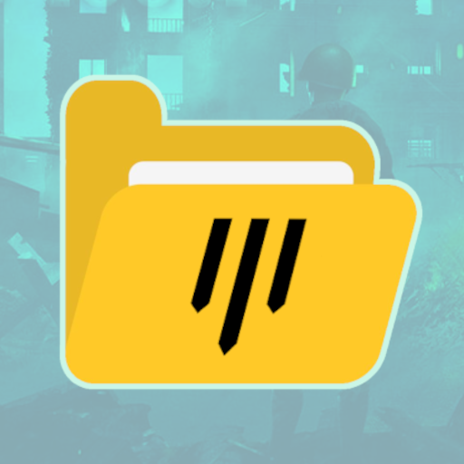

# **HLLLogUtilities** 



> For any issues or feature requests, please [open an Issue](https://github.com/timraay/HLLLogUtilities/issues) here on GitHub.

HLLLogUtilities (or HLU in short) is a Discord bot providing a clean interface to record and download logs in different formats from your Hell Let Loose server. It is capable of providing highly detailed logs with information no other program is able to capture. Plus, it may help you [enforce custom rules](#game-modifiers)!

You can [invite HLU to your server](https://discord.com/oauth2/authorize?client_id=1033779011005980773&scope=bot+applications.commands&permissions=35840) right away with no costs whatsoever, or [host a private instance](#setup-guide) yourself!

## **Easy to use!**

It takes only a few clicks to create a capture session and start recording logs. Just give a start and end time and select the server you want to record! From there on you can download the logs in formats such as `txt`, `csv` and `json`.

## **Super-detailed logs!**

HLU makes great use of its asynchronous backend by opening up multiple connections, that way it can poll player information at a blazing-fast rate. It is capable of computing all sorts of events no other tool has been capable of so far, such as players changing roles, players redeploying, players joining, leaving or creating units, and more!

# **Planned features**

This is a non-exhaustive list in no particular order of everything I *may* add one day, whenever I feel like it.

- [x] Exporting a single match from a session
- [x] Exporting statistics from a session or match
- [x] Framework for custom match modifiers
- [x] Automatic session scheduling
- [x] HeLO integration
- [ ] Command localization

# **Quickstart**

### **Prerequisites**
- A Discord server you have Manage Server or Administrator permissions in
- A Hell Let Loose server you know the RCON credentials of

### **Guide**

To get started with HLLLogUtilities, follow the below steps!

1. [Invite HLLLogUtilities](https://discord.com/oauth2/authorize?client_id=1033779011005980773&scope=bot+applications.commands&permissions=35840) to your Discord server.
2. Type in `/`, and select the `/session new` command.
3. Fill in the parameters.
    - Give it a name that you can later identify the session by, for instance "First-time test".
    - Give it a start and end time. The times have to be in UTC. Unless selected from the presented list of choices, times have to be fixed and not relative, with the exception of the word "now".
    - For the server, select "Custom". You likely won't have any other options there yet anyway.
4. Run the command. Confirm that the presented information is correct and press "Confirm". Otherwise dismiss the message and run the command again.
5. It'll ask you for your RCON credentials. Open the form and fill them in. 
    - The name doesn't have to be your actual server's name. It's purely so you will later know what server the bot is talking about.
6. Choose whether you want to save the credentials or not.

Your session is now scheduled! Now, let's wait for it to gather some logs and then view them.

1. Type in `/`, and select the `/export logs` command.
2. Fill in the parameters.
    - Select the session you created earlier.
3. Run the command and follow the on-screen instructions.

And that's everything! You can see all of your sessions with the `/session list` command. Just note that they'll be deleted after 14 days. To manage your server credentials, use the `/credentials` command.

If you want sessions to be automatically started instead of having to manually schedule them every time, consider enabling [AutoSession](#automatic-session-scheduling) as well.

> **NOTE:** All commands require **Manage Server permissions**. You can add exceptions for specific roles, channels and/or users under *Server Settings > Integrations > HLL Log Utilities*.

# **Automatic session scheduling**

Manually having to schedule sessions can be tedious and can be forgotten. That is why **AutoSession** exists! With AutoSession enabled, HLU will keep polling your server's player count even when no session is active, and start one once more than 70 players get online. When the player count drops below 30 again, or the session has been active for more than 5 hours, it will be stopped again.

Manually starting a session will interrupt any automatically created session for that same server. When a session is ended, AutoSession will wait for the server to drop below the 30 player threshold first before any new automatic session can be started again.

## Enabling AutoSession

You can enable AutoSession with just a single click! To get started, just run the `/autosession` command and select the credentials of a server. Keep in mind that AutoSession is only able to work when you let HLU store your server's credentials. If you have not yet saved any, you can add credentials with the `/credentials add` command.

## Full-time coverage

Due to performance concerns, the public instance of the bot limits the duration of automatically created sessions to a maximum 5 hours, to avoid being able to provide full-time coverage of public servers, which, if enough communities were to enable, may negatively impact the bot's performance as a whole. As such, I kindly ask you to only use this feature for event servers and not public servers.

A lot of the variables that make up AutoSession are exposed to people that [host their own instance of the bot](#setup-guide), however! So if you want full-time coverage for your public servers as well, you can simply increase the maximum duration and minimum player requirements!

# **Game Modifiers**

When creating a new session, you are given the option to enable modifiers. These modifiers can be used to enforce certain rules and track additional information, by listening and responding to incoming events from the game server.

A list of available modifiers, including what they do and how they work, can be found below.

- ## **No Panther**

    The "No Panther" modifier aims to reduce faction imbalance by disallowing the use of Panther tanks. Getting a kill with a Panther will kill its entire crew, as well as their team's commander.

- ## **One-man arty**

    The "One-man Arty" modifiers aims to assist with the enforcement of rules that limit the use of artillery down to one gunner per team. The moment a player gets a kill with artillery, they become slotted in as that team's designated artillery gunner.

    While this modifier is active, artillery gunners cannot be killed. Similarly, artillery players may not use any weapons other than artillery to target infantry.

    If any of the above rules are violated, including having a second player jump on artillery and getting a kill with it, up to 10 random players on that team will be admin-killed. Only when the team's artillery gunner stays disconnected for more than 5 minutes will the commander get a message that someone new may now jump on artillery.

# **Setup Guide**

> **NOTE:** You don't need to set up your own instance of the bot! You can use the public instance as well, the invite link for which can be found in the guide above. Self-hosting does provide you with a little more security though, as well as a handful of extra configuration options.

### **Prerequisites**
- A machine to host on, such as a VPS, dedicated server or your own PC
- [Python](https://www.python.org/downloads) 3.8 or above
- [Git](https://git-scm.com/downloads)

### **Guide**

To host your own instance of HLU, there's a few steps you have to follow. Let's start off by cloning the code from GitHub. For this you need to have Git installed.

1. Open a command terminal in the parent directory you want the files to be saaved. In here, we will later create a directory containing all the files.
2. Run the following command to download the files from GitHub:
```sh
git clone https://github.com/timraay/HLLLogUtilities.git
```
3. Go into the directory we just made:
```sh
cd HLLLogUtilities
```
4. Install all needed Python libraries.
```sh
pip3 install -r requirements.txt
```

> **NOTE:** Windows users may get an error saying they need to install Visual C++ 2014. To do this, follow the below steps:
> 1. Download and run [Visual Studio Build Tools](https://visualstudio.microsoft.com/downloads/#build-tools-for-visual-studio-2022)
> 2. Under "Workloads", select "Desktop development with C++"
> 3. Under "Invidivual components", select most relevant versions of both "C++ x64/x86 build tools" and "Windows SDK"
> 4. Install everything

Great, that's everything installed. Now we create our bot account over on Discord's developer portal.

5. Go to the [Discord developer portal](https://discord.com/developers/applications) and create a new application.
6. Go to the "Bot" tab and add a bot.
7. (optional) Add a profile picture
8. (optional) Disable the "Public Bot" setting

We've just prepared our application. Now we need to share it with our code.

9. Click on the "Reset Token" button and copy your token.
10. Open the "config.ini" file and fill in the token you've just copied. Make sure there's no trailing spaces.

And that's everything! Now we just need to run it.

11. Start the bot!
```sh
python bot.py
```

> **NOTE:** The exact command may vary per installation. On Windows it often will be `py` instead of `python`, and on Unix-like systems it is often `python3`.

This terminal will need to stay open for the bot to work. Closing down this terminal will also shut down the bot.

# **FAQ**
Frequently Asked Questions can be found [here](https://github.com/timraay/HLLLogUtilities/blob/main/FAQ.md)!

<br>

<div align=center>

**Like what you see?**

[](https://ko-fi.com/abusify)

</div>
